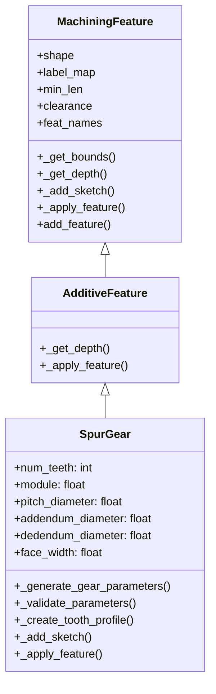
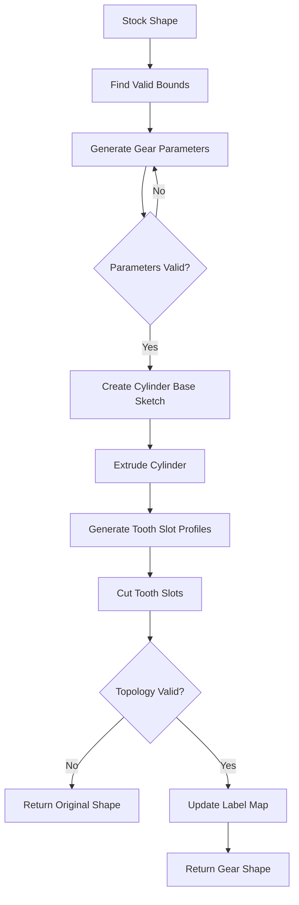

# Design Document: Spur Gear Feature

## Overview

本设计文档描述了在MFCAD++数据集生成系统中实现直齿轮（Spur Gear）特征的技术方案。该特征将继承现有的`AdditiveFeature`类，首先在基体上创建圆柱体，然后通过布尔切削操作去除材料形成齿槽，最终生成完整的直齿轮几何形状。

齿轮参数（齿数、模数）将在合理的拓扑约束范围内随机生成，确保生成的齿轮几何有效且可用于机器学习训练。

## Architecture

### 系统架构图



### 数据流图



## Components and Interfaces

### 1. SpurGear 类

主要的齿轮特征类，继承自`AdditiveFeature`。

```python
class SpurGear(AdditiveFeature):
    def __init__(self, shape, label_map, min_len, clearance, feat_names):
        """
        初始化直齿轮特征
        
        Args:
            shape: 当前的B-Rep形状
            label_map: 面标签映射字典
            min_len: 最小特征长度
            clearance: 间隙参数
            feat_names: 特征名称列表
        """
        
    def _generate_gear_parameters(self, max_diameter: float) -> tuple:
        """
        随机生成有效的齿轮参数
        
        Args:
            max_diameter: 可用的最大直径
            
        Returns:
            tuple: (num_teeth, module, pitch_d, addendum_d, dedendum_d)
        """
        
    def _validate_parameters(self, num_teeth: int, module: float, 
                            max_diameter: float) -> bool:
        """
        验证齿轮参数是否有效
        
        Args:
            num_teeth: 齿数
            module: 模数
            max_diameter: 可用的最大直径
            
        Returns:
            bool: 参数是否有效
        """
        
    def _create_tooth_profile(self, center: np.ndarray, normal: np.ndarray,
                              tooth_index: int) -> TopoDS_Face:
        """
        创建单个齿槽的轮廓
        
        Args:
            center: 齿轮中心点
            normal: 法向量
            tooth_index: 齿的索引
            
        Returns:
            TopoDS_Face: 齿槽轮廓面
        """
        
    def _add_sketch(self, bound: np.ndarray) -> TopoDS_Face:
        """
        创建圆柱体基体的草图
        
        Args:
            bound: 边界数组
            
        Returns:
            TopoDS_Face: 圆形草图面
        """
        
    def _apply_feature(self, old_shape, old_labels, feat_type, 
                       feat_face, depth_dir) -> tuple:
        """
        应用齿轮特征（创建圆柱体并切削齿槽）
        
        Args:
            old_shape: 原始形状
            old_labels: 原始标签映射
            feat_type: 特征类型
            feat_face: 特征面
            depth_dir: 深度方向向量
            
        Returns:
            tuple: (new_shape, new_labels)
        """
```

### 2. 齿轮参数计算模块

```python
# 齿轮几何参数计算
def calculate_gear_geometry(num_teeth: int, module: float) -> dict:
    """
    计算齿轮的几何参数
    
    Args:
        num_teeth: 齿数 (z)
        module: 模数 (m)
        
    Returns:
        dict: {
            'pitch_diameter': m * z,
            'addendum_diameter': m * z + 2 * m,
            'dedendum_diameter': m * z - 2.5 * m,
            'tooth_thickness': pi * m / 2,
            'addendum': m,
            'dedendum': 1.25 * m
        }
    """
```

### 3. 接口定义

#### 输入接口
- `shape`: TopoDS_Shape - 当前的B-Rep形状
- `label_map`: dict - 面到标签的映射
- `bounds`: list - 可用的边界区域列表

#### 输出接口
- `shape`: TopoDS_Shape - 添加齿轮后的形状
- `label_map`: dict - 更新后的标签映射
- `bounds`: list - 更新后的边界列表

## Data Models

### 齿轮参数数据结构

```python
@dataclass
class GearParameters:
    num_teeth: int          # 齿数，范围 [8, 30]
    module: float           # 模数，范围 [0.5, 2.0]
    pitch_diameter: float   # 分度圆直径 = m * z
    addendum_diameter: float  # 齿顶圆直径 = m * z + 2m
    dedendum_diameter: float  # 齿根圆直径 = m * z - 2.5m
    face_width: float       # 齿宽（圆柱高度）
    pressure_angle: float = 20.0  # 压力角（度）
```

### 齿槽几何数据结构

```python
@dataclass
class ToothSlotGeometry:
    slot_depth: float       # 槽深 = addendum - dedendum
    slot_width: float       # 槽宽 ≈ π * m / 2
    angular_position: float # 角度位置 = 2π * i / z
```

### 参数约束

| 参数 | 最小值 | 最大值 | 约束条件 |
|------|--------|--------|----------|
| num_teeth | 8 | 30 | 整数 |
| module | 0.5 | 2.0 | 浮点数 |
| addendum_diameter | - | max_bound_size - clearance | 必须小于可用空间 |
| face_width | min_len | max_depth | 随机生成 |


## Correctness Properties

*A property is a characteristic or behavior that should hold true across all valid executions of a system-essentially, a formal statement about what the system should do. Properties serve as the bridge between human-readable specifications and machine-verifiable correctness guarantees.*

### Property 1: Parameter Bounds

*For any* generated gear parameters, the number of teeth (z) SHALL be within [8, 30] and the module (m) SHALL be within [0.5, 2.0].

**Validates: Requirements 1.1, 1.2**

### Property 2: Gear Geometry Consistency

*For any* valid gear with parameters (z, m), the following geometric relationships SHALL hold:
- pitch_diameter == m × z
- addendum_diameter == m × z + 2m
- dedendum_diameter == m × z - 2.5m
- addendum_diameter <= available_bound_size - clearance
- slot_depth == 1.25 × m (which equals addendum - dedendum)
- slot_width ≈ π × m / 2 (within 10% tolerance)

**Validates: Requirements 1.3, 1.5, 1.6, 3.4, 3.5**

### Property 3: Cylinder Geometry

*For any* created gear feature:
- The cylinder diameter SHALL equal the addendum circle diameter (da)
- The cylinder height (face_width) SHALL be within [min_len, max_available_depth]
- The cylinder center SHALL be positioned at the center of the selected bound

**Validates: Requirements 2.2, 2.3, 2.4**

### Property 4: Tooth Slot Count

*For any* gear with z teeth, there SHALL be exactly z tooth slots evenly distributed around the pitch circle at angular intervals of 2π/z radians.

**Validates: Requirements 3.3**

### Property 5: Topological Validity

*For any* successfully created gear:
- The resulting shape SHALL contain exactly one solid (TopologyExplorer.number_of_solids() == 1)
- All faces SHALL be properly connected (valid B-Rep topology)
- The shape SHALL pass OCC's shape validity checks

**Validates: Requirements 4.3, 6.1, 6.2**

### Property 6: Label Map Integrity

*For any* gear feature creation:
- All newly created faces SHALL have the gear feature label (feat_names.index("spur_gear"))
- All original faces that remain unchanged SHALL preserve their original labels
- The label map SHALL use the correct feature index from feat_names

**Validates: Requirements 5.1, 5.2, 5.3**

### Property 7: Return Value Completeness

*For any* successful gear creation, the add_feature method SHALL return a tuple containing:
- The modified shape with the gear feature
- The updated label map with correct face labels
- The bounds list for subsequent feature placement

**Validates: Requirements 4.5, 6.5**

## Error Handling

### 错误场景与处理策略

| 错误场景 | 检测方法 | 处理策略 |
|----------|----------|----------|
| 参数生成失败（空间不足） | addendum_diameter > bound_size - clearance | 重试最多10次，然后返回原始形状 |
| 布尔运算失败 | BRepAlgoAPI_Cut/Fuse 返回空形状 | 返回原始形状和标签映射 |
| 拓扑无效（多个实体） | TopologyExplorer.number_of_solids() > 1 | 返回原始形状和标签映射 |
| 边界检测失败 | len(bounds) == 0 | 返回原始形状和标签映射 |
| 齿槽切削失败 | 单个齿槽布尔运算失败 | 跳过该齿槽，继续处理其他齿槽 |

### 错误处理代码模式

```python
def _apply_feature(self, old_shape, old_labels, feat_type, feat_face, depth_dir):
    try:
        # 1. 创建圆柱体基体
        cylinder_shape = self._create_cylinder(...)
        if cylinder_shape.IsNull():
            return old_shape, old_labels
            
        # 2. 融合圆柱体与基体
        fused_shape = BRepAlgoAPI_Fuse(old_shape, cylinder_shape).Shape()
        if fused_shape.IsNull():
            return old_shape, old_labels
            
        # 3. 切削齿槽
        for i in range(self.num_teeth):
            tooth_slot = self._create_tooth_slot(i)
            if tooth_slot.IsNull():
                continue  # 跳过失败的齿槽
            fused_shape = BRepAlgoAPI_Cut(fused_shape, tooth_slot).Shape()
            
        # 4. 验证拓扑
        topo = TopologyExplorer(fused_shape)
        if topo.number_of_solids() != 1:
            return old_shape, old_labels
            
        # 5. 更新标签映射
        new_labels = self._update_labels(old_labels, old_shape, fused_shape)
        return fused_shape, new_labels
        
    except Exception as e:
        print(f"Spur gear creation failed: {e}")
        return old_shape, old_labels
```

## Testing Strategy

### 测试框架

使用 `pytest` 作为测试框架，配合 `hypothesis` 进行属性测试。

### 单元测试

单元测试用于验证特定示例和边界情况：

1. **参数生成测试**
   - 测试最小齿数（z=8）的齿轮生成
   - 测试最大齿数（z=30）的齿轮生成
   - 测试边界模数值（m=0.5, m=2.0）

2. **几何计算测试**
   - 测试已知参数的分度圆直径计算
   - 测试已知参数的齿顶圆/齿根圆直径计算

3. **错误处理测试**
   - 测试空间不足时的优雅失败
   - 测试布尔运算失败时的回退行为

4. **集成测试**
   - 测试齿轮特征与其他特征的组合
   - 测试在shape_from_directive中的使用

### 属性测试

属性测试用于验证普遍性质，每个属性测试至少运行100次迭代。

```python
# 属性测试配置
import hypothesis
from hypothesis import given, settings, strategies as st

@settings(max_examples=100)
@given(
    num_teeth=st.integers(min_value=8, max_value=30),
    module=st.floats(min_value=0.5, max_value=2.0)
)
def test_property_gear_geometry_consistency(num_teeth, module):
    """
    Feature: spur-gear-feature, Property 2: Gear Geometry Consistency
    Validates: Requirements 1.3, 1.5, 1.6, 3.4, 3.5
    """
    # 测试实现
    pass
```

### 测试标注格式

每个属性测试必须包含以下注释：
- **Feature: {feature_name}, Property {number}: {property_text}**
- **Validates: Requirements X.Y**

### 测试覆盖矩阵

| 属性 | 单元测试 | 属性测试 | 需求覆盖 |
|------|----------|----------|----------|
| Property 1: Parameter Bounds | ✓ | ✓ | 1.1, 1.2 |
| Property 2: Gear Geometry Consistency | ✓ | ✓ | 1.3, 1.5, 1.6, 3.4, 3.5 |
| Property 3: Cylinder Geometry | ✓ | ✓ | 2.2, 2.3, 2.4 |
| Property 4: Tooth Slot Count | ✓ | ✓ | 3.3 |
| Property 5: Topological Validity | ✓ | ✓ | 4.3, 6.1, 6.2 |
| Property 6: Label Map Integrity | ✓ | ✓ | 5.1, 5.2, 5.3 |
| Property 7: Return Value Completeness | ✓ | ✓ | 4.5, 6.5 |
